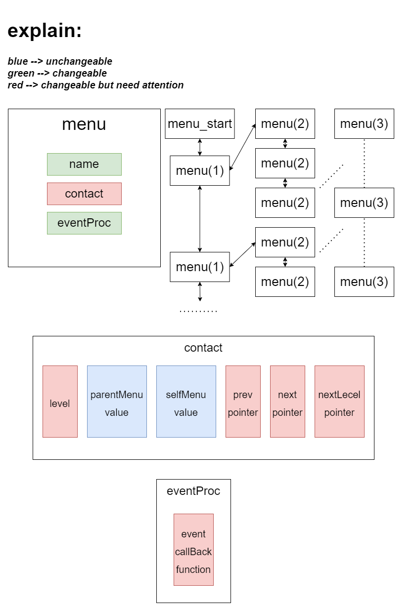
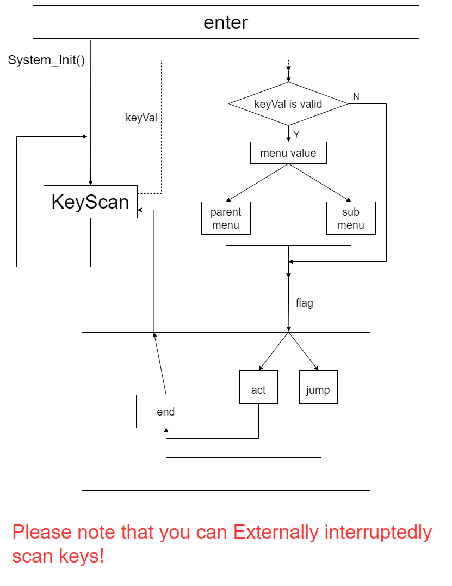
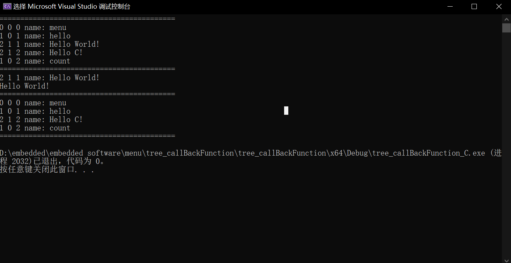
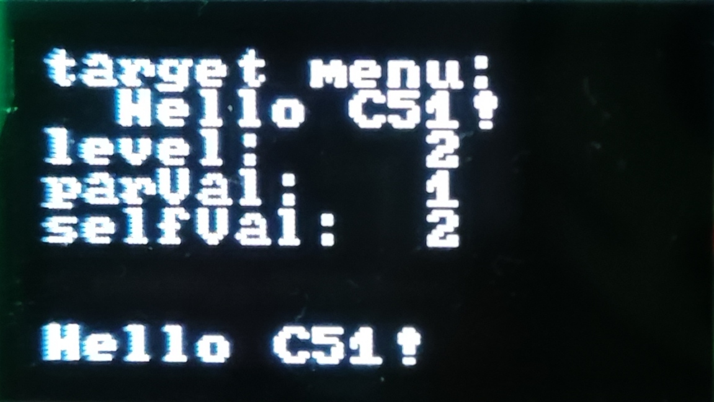

# 更新日志 #

2022-12-14

	1. 在C51的例程 `EC11` 中新增了菜单选择功能（旋转编码器选择）和确定进入/执行菜单功能（按键）。
	2. 在C51的例程 `EC11` 中新增了危险菜单检测功能（没有封装成函数，在主函数中实现），能够检测当前的 `currentMenu` 指针是否指向危险菜单（没有下一级菜单的菜单），如果指向危险菜单，则会在下一次按下按键时，返回安全菜单，此时 `currentMenu` 和 `pointerMenu` 将会被重置成前一步的初始状态，即他们俩均指向危险菜单的父级菜单。
	3. 初步实现的菜单事件触发，若出发的事件是信息显示等无需下一步操作的事件，将会在下一次按下按键时返回当前菜单的父级菜单。

	补充说明：

	暂时没有实现普通菜单返回上一级的功能。

# 树形结构菜单 #

一种基于树形结构的C51单片机菜单管理系统。

已测试型号：STC8H8K64U。

## 单个菜单结构 ##

本菜单系统中的单个菜单分为 `信息区块` 、 `连接件区块` 、 `事件区块` 三部分，详细信息见下图：

图中表明，信息区块只有一个 `name` 成员，它是菜单个体的名称；事件区块包含了一个函数指针，通过回调函数的形式执行任务；连接件区块可分为两个部分，分别是 `连接信息` 和 `连接手臂` ，连接信息包含 `菜单等级` 、 `父级菜单等级` 、 `菜单编号` 三个部分，连接手臂包含 `前向指针` 、 `后向指针` 、 `下一级指针` 三个部分。

菜单之间采用树形结构连接。

## 一种菜单系统在C51中运用的构想 ##

## 菜单系统的简单运用 ##

已经在C语言环境和C51环境中简单测试了一下菜单系统。

### C语言环境下的测试程序 ###

	/**
	 * @file main.c
	 * @encoding UTF-8
	 * @author yewan
	 * @brief 菜单系统
	 * @version 0.1
	 * @date 2022-11-30
	 *
	 */

	#include "main.h"

	menu_t menu_Start = {  // 开始菜单（开始画面）
	    "menu", 0, 0, 0, NULL, NULL, NULL, NULL
	};
	menu_t menu_OneLevel[] = {  // 一级菜单
	    { "hello", 1, 0, 1, NULL, NULL, NULL, NULL },
	    { "count", 1, 0, 2, NULL, NULL, NULL, NULL }
	};
	menu_t menu_TwoLevel[] = {  // 二级菜单
	    { "Hello World!", 2, 1, 1, NULL, NULL, NULL, print_Hello },
	    { "Hello C!", 2, 1, 2, NULL, NULL, NULL, print_Hello_C }
	};

	int main()
	{
	    menu_t* q = NULL;
	    menu_t menu_Temp = {
	        .level = 2,
	        .selfVal = 1
	    };

	    insert_Menu(&menu_Start, &menu_OneLevel[0]);
	    insert_Menu(&menu_Start, &menu_OneLevel[1]);
	    insert_Menu(&menu_Start, &menu_TwoLevel[0]);
	    insert_Menu(&menu_Start, &menu_TwoLevel[1]);
	    printf("==========================================\r\n");
	    traversal_Menu(&menu_Start);
	    printf("==========================================\r\n");
	    q = find_Menu(&menu_Start, &menu_Temp);
	    if (q != NULL) {
	        printf("%d %d %d name: %s\r\n", q->level, q->parVal, q->selfVal, q->name);
	        q->eventCB(q);
	    }
	    else printf("not find!\a\r\n");
	    delete_Menu(&menu_Start, &menu_Temp);
	    printf("==========================================\r\n");
	    traversal_Menu(&menu_Start);
	    printf("==========================================\r\n");

	    return 0;
	}

测试结果：

### C51环境下的测试程序 ###

	#include "main.h"

	#ifdef NULL
		 char address_is_null _at_ (0x0000);
	#else
		#define NULL		((void*)0)
	#endif /* NULL */

	menu_t menu_Start = {  // 开始菜单（开始画面）
		"menu", 0, 0, 0, NULL, NULL, NULL, NULL
	};
	menu_t menu_OneLevel[] = {  // 一级菜单
		{ "hello", 1, 0, 1, NULL, NULL, NULL, NULL },
		{ "count", 1, 0, 2, NULL, NULL, NULL, NULL }
	};
	menu_t menu_TwoLevel[] = {  // 二级菜单
		{ "Hello World!", 2, 1, 1, NULL, NULL, NULL, OLED_Show_Hello_World },
		{ "Hello C51!", 2, 1, 2, NULL, NULL, NULL, OLED_Show_Hello_C51 }
	};

	void System_Init(void)
	{
		My_USART_Init();
		key_Init();
		OLED_Init();

		MyTimer_Init();

		EA_OPN();  // 开启总中断
	}

	void main()
	{
		menu_t* q = &menu_OneLevel[0];
		menu_t* mark = &menu_OneLevel[0];
		menu_t menu_Temp;
		menu_Temp.level = 2;
		menu_Temp.selfVal = 2;

		System_Init();

	    insert_Menu(&menu_Start, &menu_OneLevel[0]);
	    insert_Menu(&menu_Start, &menu_OneLevel[1]);
	    insert_Menu(&menu_Start, &menu_TwoLevel[0]);
	    insert_Menu(&menu_Start, &menu_TwoLevel[1]);

		q = find_Menu(&menu_Start, &menu_Temp);
		if(q != NULL) {
			OLED_Show_Menu_Infor(q); OLED_Refresh_Gram();
			q->eventCB(q);
		} else {
			OLED_Fill(0, 56, 128 - 1, 56 + 8, CLEAR);
			OLED_ShowString(0, 58, (u8*)"not find!", 8, FILL);
			OLED_Refresh_Gram();
		}

		while(1)
		{
			;
		}
	}

测试结果：

